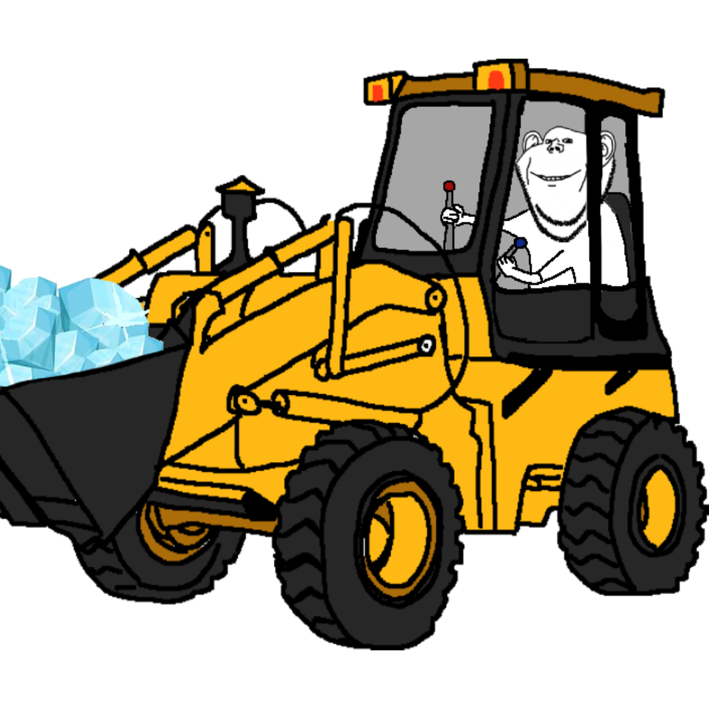

<!-- Improved compatibility of back to top link: See: https://github.com/othneildrew/Best-README-Template/pull/73 -->
<a id="readme-top"></a>
<!--
*** Thanks for checking out the Best-README-Template. If you have a suggestion
*** that would make this better, please fork the repo and create a pull request
*** or simply open an issue with the tag "enhancement".
*** Don't forget to give the project a star!
*** Thanks again! Now go create something AMAZING! :D
-->


<!-- PROJECT SHIELDS -->
<!--
*** I'm using markdown "reference style" links for readability.
*** Reference links are enclosed in brackets [ ] instead of parentheses ( ).
*** See the bottom of this document for the declaration of the reference variables
*** for contributors-url, forks-url, etc. This is an optional, concise syntax you may use.
*** https://www.markdownguide.org/basic-syntax/#reference-style-links
-->
[![Contributors][contributors-shield]][contributors-url]
[![Forks][forks-shield]][forks-url]
[![Stargazers][stars-shield]][stars-url]
[![Issues][issues-shield]][issues-url]
[![project_license][license-shield]][license-url]
[![LinkedIn][linkedin-shield]][linkedin-url]


<!-- PROJECT LOGO -->
<br />
<div align="center">
  <a href="https://github.com/thatfrozenfrog/killdozer">
    
  </a>

<h3 align="center">KILL'DOZER</h3>

  <p align="center">
    Telehack vantawhite cheat client
    <br />
    <a href="https://github.com/thatfrozenfrog/KILLDOZER/releases/latest"><strong>Download here »</strong></a>
    <br />
    <br />
    <a href="https://github.com/thatfrozenfrog/KILLDOZER/blob/main/extern/demo.webm">View Demo</a>
    &middot;
    <a href="https://github.com/thatfrozenfrog/killdozer/issues/new?labels=bug&template=bug-report---.md">Report Bug</a>
    &middot;
    <a href="https://github.com/thatfrozenfrog/killdozer/issues/new?labels=enhancement&template=feature-request---.md">Request Feature</a>
  </p>
</div>


<!-- TABLE OF CONTENTS -->
<details>
  <summary>Table of Contents</summary>
  <ol>
    <li>
      <a href="#about-the-project">About The Project</a>
      <ul>
        <li><a href="#built-with">Built With</a></li>
      </ul>
    </li>
    <li>
      <a href="#getting-started">Getting Started</a>
      <ul>
        <li><a href="#prerequisites">Prerequisites</a></li>
        <li><a href="#installation">Installation</a></li>
      </ul>
    </li>
    <li><a href="#usage">Usage</a></li>
    <li><a href="#roadmap">Roadmap</a></li>
    <li><a href="#contributing">Contributing</a></li>
    <li><a href="#license">License</a></li>
    <li><a href="#contact">Contact</a></li>
    <li><a href="#acknowledgments">Acknowledgments</a></li>
  </ol>
</details>


<!-- ABOUT THE PROJECT -->
## About The Project

[![Product Name Screen Shot][product-screenshot]](https://example.com)

Killdozer is the only cross-platform desktop cheat client for [Telehack](https://telehack.com). Powered by Rust and Typescript with dynamically linked C code (buzzwords), this is undoubtedly the most vantagem that nuked [Telehack](https://telehack.com) (since [TeleSOVLS](https://github.com/thatfrozenfrog/telesovls) or something).

<p align="right">(<a href="#readme-top">back to top</a>)</p>


### Built With
* [![Tauri][Tauri.app]][Tauri-url]
* [![Rust][Rustlang.rs]][Rust-url]
* [![C][Clang.org]][Clang-url]
* [![Typescript][Typescriptlang]][Typescript-url]
* [![Three.js][Threejs.org]][Threejs-url]
* [![Blender][Blender.org]][Blender-url]

<p align="right">(<a href="#readme-top">back to top</a>)</p>


<!-- GETTING STARTED -->
## Getting Started

How to compile and install the project LOLcally.

### Prerequisites

Before compiling the app, make sure you have the required tooling installed for a Tauri application.

* Node.js and npm (or pnpm)
  ```sh
  npm install -g npm@latest
  ```
* Rust and Cargo
  ```sh
  curl --proto '=https' --tlsv1.2 -sSf https://sh.rustup.rs | sh
  ```
* Tauri system dependencies
  - Linux: install `webkit2gtk 4.1`, `libgtk-3-dev`, `libayatana-appindicator3-dev`, `librsvg2-dev`, and related build tools
  - macOS: Xcode Command Line Tools
  - Windows: Visual Studio C++ Build Tools

### Installation

1. Clone the repository
   ```sh
   git clone https://github.com/thatfrozenfrog/killdozer.git
   cd killdozer
   ```
2. Install JavaScript dependencies
   ```sh
   npm install
   ```
3. Install Rust dependencies and prepare the Tauri app
   ```sh
   cargo fetch
   ```
4. Build the application
   ```sh
   npm run tauri build
   ```
   or for a development build:
   ```sh
   npm run tauri dev
   ```
5. If you need to use a different remote origin, update it as needed
   ```sh
   git remote set-url origin <your-fork-or-repo-url>
   git remote -v
   ```

<p align="right">(<a href="#readme-top">back to top</a>)</p>


<!-- USAGE EXAMPLES -->
## Usage

[]()

<p align="right">(<a href="#readme-top">back to top</a>)</p>


<!-- ROADMAP -->
## Roadmap

- [ ] Implement C backend
- [x] Safe test environment
- [ ] Implement better profile management 
    - [ ] Proxy autofetch
- [ ] Overhaul on cheat orchestration

See the [open issues](https://github.com/thatfrozenfrog/killdozer/issues) for a full list of proposed features (and known issues).

<p align="right">(<a href="#readme-top">back to top</a>)</p>


<!-- CONTRIBUTING -->
## Contributing

Contributions are what make the open source community such an amazing place to learn, inspire, and create. Any contributions you make are **greatly appreciated**.

If you have a suggestion that would make this better, please fork the repo and create a pull request. You can also simply open an issue with the tag "enhancement".
Don't forget to give the project a star! Thanks again!

1. Fork the Project
2. Create your Feature Branch (`git checkout -b feature/AmazingFeature`)
3. Commit your Changes (`git commit -m 'Add some AmazingFeature'`)
4. Push to the Branch (`git push origin feature/AmazingFeature`)
5. Open a Pull Request

<p align="right">(<a href="#readme-top">back to top</a>)</p>

### Top contributors:

<a href="https://github.com/thatfrozenfrog/killdozer/graphs/contributors">
  
</a>


<!-- LICENSE -->
## License

Distributed under the NOOPER License. See [`LICENSE.md`](LICENSE.md) for more information.

<p align="right">(<a href="#readme-top">back to top</a>)</p>


<!-- CONTACT -->
## Contact

Kiwi - [@kiwi](https://reisen.systems/member.php?action=profile&uid=2) - kiwi@reisen.systems

Project Link: [https://github.com/thatfrozenfrog/killdozer](https://github.com/thatfrozenfrog/killdozer)

<p align="right">(<a href="#readme-top">back to top</a>)</p>


<!-- MARKDOWN LINKS & IMAGES -->
<!-- https://www.markdownguide.org/basic-syntax/#reference-style-links -->
[contributors-shield]: https://img.shields.io/github/contributors/thatfrozenfrog/killdozer.svg?style=for-the-badge
[contributors-url]: https://github.com/thatfrozenfrog/killdozer/graphs/contributors
[forks-shield]: https://img.shields.io/github/forks/thatfrozenfrog/killdozer.svg?style=for-the-badge
[forks-url]: https://github.com/thatfrozenfrog/killdozer/network/members
[stars-shield]: https://img.shields.io/github/stars/thatfrozenfrog/killdozer.svg?style=for-the-badge
[stars-url]: https://github.com/thatfrozenfrog/killdozer/stargazers
[issues-shield]: https://img.shields.io/github/issues/thatfrozenfrog/killdozer.svg?style=for-the-badge
[issues-url]: https://github.com/thatfrozenfrog/killdozer/issues
[license-shield]: https://img.shields.io/github/license/thatfrozenfrog/killdozer.svg?style=for-the-badge
[license-url]: https://github.com/thatfrozenfrog/killdozer/blob/master/LICENSE.md
[linkedin-shield]: https://img.shields.io/badge/-LinkedIn-black.svg?style=for-the-badge&logo=linkedin&colorB=555
[linkedin-url]: https://linkedin.com/in/giga-chad-64a930222/
[product-screenshot]: extern/dozerbanner.png
<!-- Shields.io badges. You can a comprehensive list with many more badges at: https://github.com/inttter/md-badges -->
[Tauri.app]: https://img.shields.io/badge/Tauri-24C8D8?style=for-the-badge&logo=tauri&logoColor=white
[Tauri-url]: https://tauri.app

[Clang.org]: https://img.shields.io/badge/C-00599C?style=for-the-badge&logo=c&logoColor=white
[Clang-url]: https://www.c-language.org/

[Typescriptlang]: https://img.shields.io/badge/TypeScript-3178C6?style=for-the-badge&logo=typescript&logoColor=fff
[Typescript-url]: https://www.typescriptlang.org/

[Rustlang.rs]: https://img.shields.io/badge/Rust-000000?style=for-the-badge&logo=rust&logoColor=white
[Rust-url]: https://www.rust-lang.org/

[Threejs.org]: https://img.shields.io/badge/Three.js-000000?style=for-the-badge&logo=three.js&logoColor=white
[Threejs-url]: https://threejs.org/

[Blender.org]: https://img.shields.io/badge/Blender-F5792A?style=for-the-badge&logo=blender&logoColor=white
[Blender-url]: https://www.blender.org/